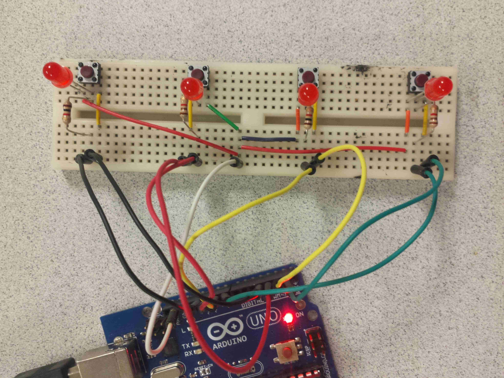
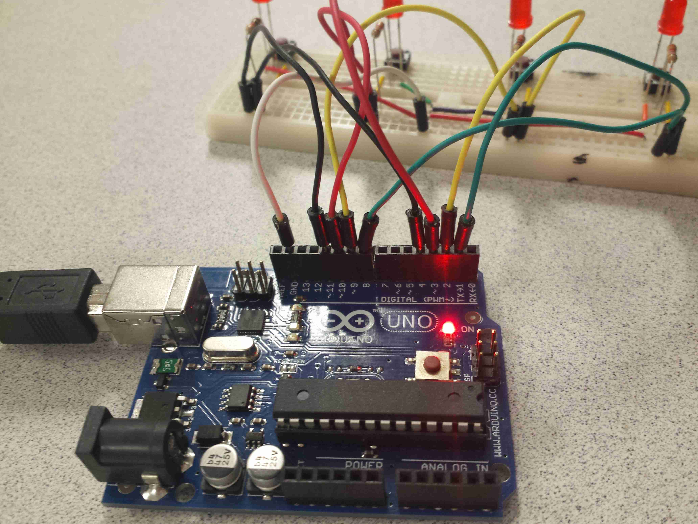

# microcontroller-simon
Microcontroller-powered Game of Simon Says
Total project time: 5 hours

## Note
The buttons use the INPUT_PULLUP mode, meaning the circuit goes from ground -> button -> input pin as opposed to using power.

## Media
[YouTube Demo](http://youtu.be/hPLCx52r1e4)

